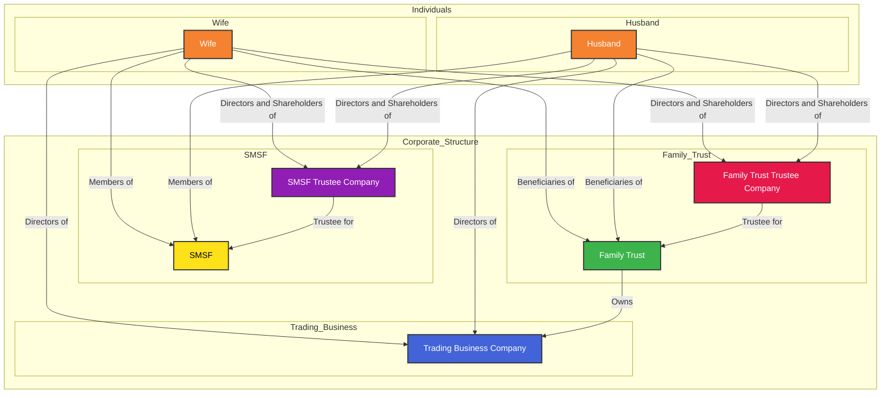

```mermaid
graph TB
    subgraph Individuals
        subgraph Husband
            E[Husband]
        end
        subgraph Wife
            F[Wife]
        end
    end

    subgraph Corporate_Structure
        subgraph SMSF
            C[SMSF]
            G[SMSF Trustee Company]
        end
        
        subgraph Trading_Business
            D[Trading Business Company]
        end

        subgraph Family_Trust
            A[Family Trust Trustee Company]
            B[Family Trust]
        end
    end

    A -->|Trustee for| B
    G -->|Trustee for| C
    B -->|Owns| D
    
    E & F -->|Members of| C
    E & F -->|Beneficiaries of| B
    E & F -->|Directors and Shareholders of| A
    E & F -->|Directors and Shareholders of| G
    E & F -->|Directors of| D

    style A fill:#e6194B,stroke:#333,stroke-width:2px,color:#fff
    style B fill:#3cb44b,stroke:#333,stroke-width:2px,color:#fff
    style C fill:#ffe119,stroke:#333,stroke-width:2px,color:#000
    style D fill:#4363d8,stroke:#333,stroke-width:2px,color:#fff
    style E fill:#f58231,stroke:#333,stroke-width:2px,color:#fff
    style F fill:#f58231,stroke:#333,stroke-width:2px,color:#fff
    style G fill:#911eb4,stroke:#333,stroke-width:2px,color:#fff
```
