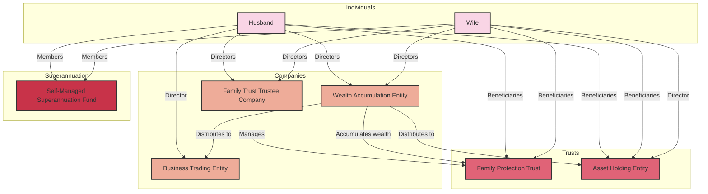

```mermaid
graph TB
    subgraph Individuals
        H[Husband]
        W[Wife]
    end

    subgraph Companies
        FTTC[Family Trust Trustee Company]
        BTE[Business Trading Entity]
        WAE[Wealth Accumulation Entity]
    end

    subgraph Trusts
        FPT[Family Protection Trust]
        AHE[Asset Holding Entity]
    end

    subgraph Superannuation
        SMSF[Self-Managed Superannuation Fund]
    end

    H & W -->|Beneficiaries| FPT
    H & W -->|Beneficiaries| AHE
    H & W -->|Members| SMSF
    H -->|Director| BTE
    W -->|Director| AHE
    H & W -->|Directors| FTTC
    H & W -->|Directors| WAE

    FTTC -->|Manages| FPT
    WAE -->|Accumulates wealth| FPT
    WAE -->|Distributes to| BTE
    WAE -->|Distributes to| AHE

    classDef individual fill:#f9d5e5,stroke:#333,stroke-width:2px;
    classDef company fill:#eeac99,stroke:#333,stroke-width:2px;
    classDef trust fill:#e06377,stroke:#333,stroke-width:2px;
    classDef superfund fill:#c83349,stroke:#333,stroke-width:2px;

    class H,W individual
    class FTTC,BTE,WAE company
    class FPT,AHE trust
    class SMSF superfund
```
