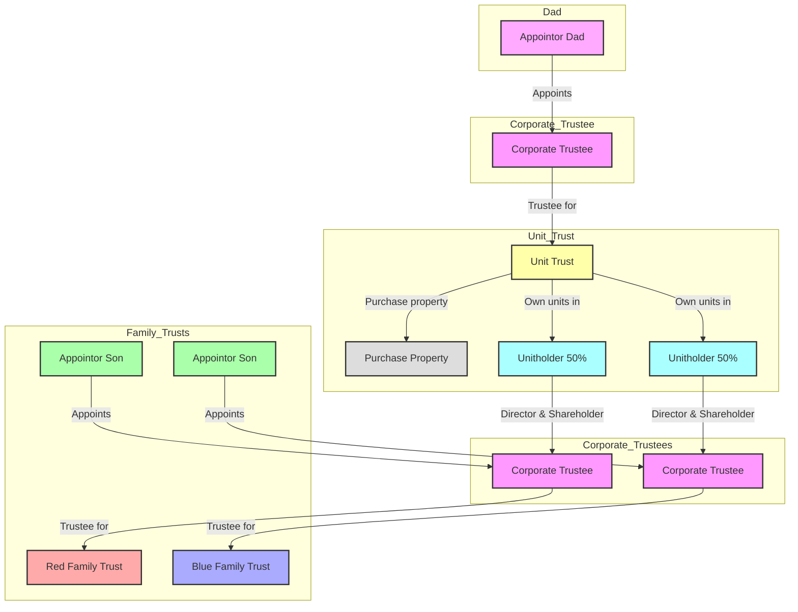

```mermaid
graph TB
    subgraph Corporate_Trustee
        CT[Corporate Trustee]
    end

    subgraph Unit_Trust
        UT[Unit Trust]
        CT -->|Trustee for| UT
        UT -->|Purchase property| PP[Purchase Property]
        UH1[Unitholder 50%]
        UH2[Unitholder 50%]
        UT -->|Own units in| UH1 & UH2
    end

    subgraph Corporate_Trustees
        CT1[Corporate Trustee]
        CT2[Corporate Trustee]
        UH1 -->|Director & Shareholder| CT1
        UH2 -->|Director & Shareholder| CT2
    end

    subgraph Family_Trusts
        FT1[Red Family Trust]
        FT2[Blue Family Trust]
        CT1 -->|Trustee for| FT1
        CT2 -->|Trustee for| FT2
        A1[Appointor Son]
        A2[Appointor Son]
        A1 -->|Appoints| CT1
        A2 -->|Appoints| CT2
    end

    subgraph Dad
        D[Appointor Dad]
        D -->|Appoints| CT
    end

    style CT fill:#f9f,stroke:#333,stroke-width:2px
    style UT fill:#ffa,stroke:#333,stroke-width:2px
    style UH1 fill:#aff,stroke:#333,stroke-width:2px
    style UH2 fill:#aff,stroke:#333,stroke-width:2px
    style CT1 fill:#f9f,stroke:#333,stroke-width:2px
    style CT2 fill:#f9f,stroke:#333,stroke-width:2px
    style FT1 fill:#faa,stroke:#333,stroke-width:2px
    style FT2 fill:#aaf,stroke:#333,stroke-width:2px
    style A1 fill:#afa,stroke:#333,stroke-width:2px
    style A2 fill:#afa,stroke:#333,stroke-width:2px
    style D fill:#faf,stroke:#333,stroke-width:2px
    style PP fill:#ddd,stroke:#333,stroke-width:2px
```
