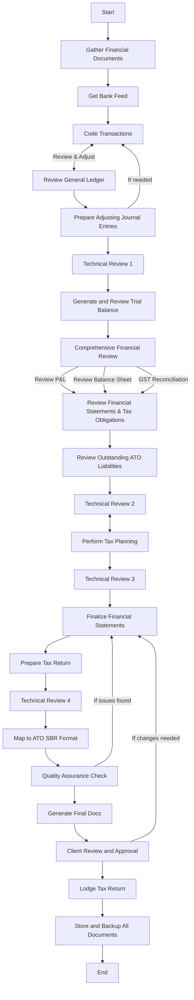

```mermaid
graph TD
    A[Start] --> B[Gather Financial Documents]
    B --> C[Get Bank Feed]
    C --> D[Code Transactions]
    D <--> |Review & Adjust| E[Review General Ledger]
    E --> F[Prepare Adjusting Journal Entries]
    F --> |If needed| D
    F --> G[Technical Review 1]
    G --> H[Generate and Review Trial Balance]
    H --> I[Comprehensive Financial Review]
    I --> |Review P&L| J[Review Financial Statements & Tax Obligations]
    I --> |Review Balance Sheet| J
    I --> |GST Reconciliation| J
    J --> K[Review Outstanding ATO Liabilities]
    K --> L[Technical Review 2]
    L <--> M[Perform Tax Planning]
    M --> N[Technical Review 3]
    N --> O[Finalize Financial Statements]
    O --> P[Prepare Tax Return]
    P --> Q[Technical Review 4]
    Q --> R[Map to ATO SBR Format]
    R --> S[Quality Assurance Check]
    S --> |If issues found| O
    S --> T[Generate Final Docs]
    T --> U[Client Review and Approval]
    U --> |If changes needed| O
    U --> V[Lodge Tax Return]
    V --> W[Store and Backup All Documents]
    W --> X[End]
```
